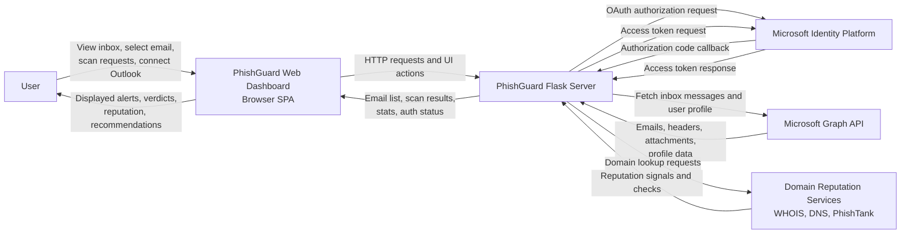
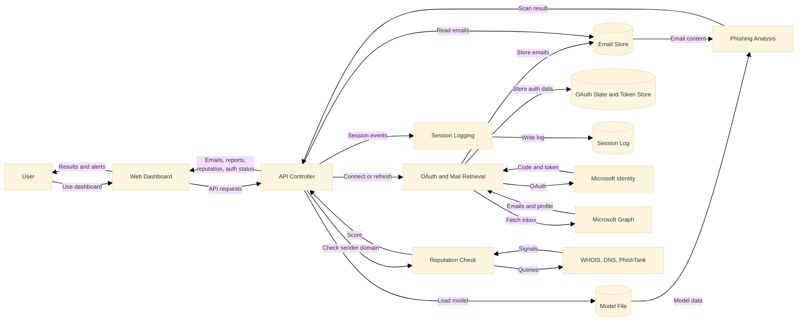

# PhishGuard Data Flow Diagram

This DFD is based on the current implementation in the `webdash copy` project folder.

## High-Level Overview

PhishGuard is a web-based phishing detection system that helps a user review emails, scan them for phishing indicators, and view security insights in a dashboard. At a high level, the system has three main parts: the browser-based dashboard, the Flask backend server, and external services such as Microsoft Outlook, Microsoft Graph, and reputation lookup services.

The user interacts with the dashboard to load emails, connect an Outlook account, request phishing scans, and review the results. The dashboard sends these requests to the Flask server, which acts as the central controller of the system. The server retrieves emails from Microsoft Graph when Outlook is connected, loads the trained phishing detection model, performs phishing analysis on email content, checks sender-domain reputation, and returns the processed results to the frontend.

The system also uses several data stores to support its operation. A trained model file is used for phishing classification, in-memory stores keep fetched emails and scan results, a temporary token store supports Outlook authentication, a reputation cache avoids repeating domain checks, and a log file records session activity such as login and logout events. Together, these flows show how user actions are transformed into analyzed email security results.

## Level 0 Context Diagram

## Hybrid Overview Diagram

## Main Processes

1. `1.0 Frontend Email Dashboard`
   Receives user actions and calls the Flask API using `fetch()` from `static/js/app.js`.

2. `2.0 Flask API Controller`
   Serves the SPA, exposes email, scan, stats, reputation, and auth endpoints in `app.py`.

3. `3.0 Outlook OAuth and Mail Retrieval`
   Handles Microsoft OAuth, stores temporary PKCE state, retrieves user profile and inbox emails from Microsoft Graph.

4. `4.0 Phishing Analysis Engine`
   Uses the loaded `PhishingDetector` model to combine text analysis, URL analysis, and header authentication checks.

5. `5.0 Domain Reputation Checker`
   Calculates sender-domain trust using local heuristics plus optional WHOIS, DNS, and PhishTank checks.

6. `6.0 Session Logging`
   Records login and logout summaries to `phishguard_log.txt`.

## Data Stores

1. `D1 Model File`
   Stored classifier and vectorizer in `phishing_model.pkl`.

2. `D2 In-Memory Email Store`
   Cached Outlook inbox data kept in `_live_emails`.

3. `D3 In-Memory Scan Cache`
   Scan results for each email index kept in `scan_results`.

4. `D4 OAuth State and Token Store`
   Temporary OAuth state, PKCE verifier, and access token data.

5. `D5 Reputation Cache`
   Cached domain reputation lookups in `_domain_rep_cache`.

6. `D6 Log File`
   Session activity written to `phishguard_log.txt`.

## Short Narrative

The user interacts with the browser dashboard, which sends API requests to the Flask server. The Flask server either retrieves inbox emails from Microsoft Graph, analyzes email content with the phishing detection engine, or computes sender-domain reputation. Results are cached in memory, returned to the frontend for display, and important session events are written to a log file.
